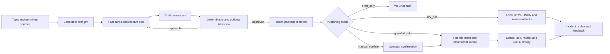
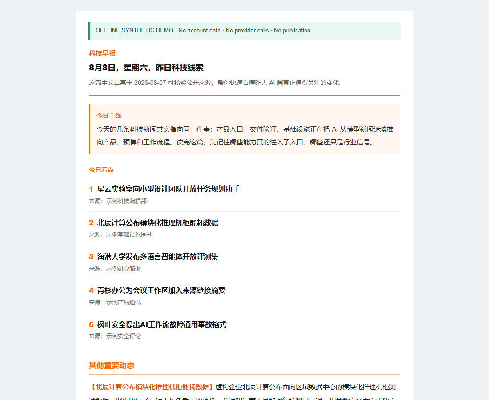

# wechat-official-account-pipeline

[简体中文](README.zh-CN.md)

> An auditable, human-in-the-loop automation pipeline for WeChat Official Accounts, covering topic discovery, drafting, review, scheduling, publishing, and performance feedback.

This project turns a fragile "generate text and call an API" script into an observable publishing workflow. Every run creates reviewable artifacts, records decisions, enforces idempotency, and keeps a person in control of risky actions.

Status: **v0.1.0 release candidate**. The repository starts in offline `dry_run` mode. External model calls and WeChat writes are disabled until an operator explicitly enables them.

## Why this exists

Publishing automation fails in expensive ways: weak source material becomes confident prose, model output changes shape, retries multiply provider costs, and a timed job can submit the same article twice. This project treats those as workflow and state-management problems, not merely prompt-writing problems.

Compared with a typical auto-posting script, it provides:

| Concern | Typical script | This project |
| --- | --- | --- |
| Inputs | One prompt or scraped page | Ranked candidates, reserve items and source metadata |
| Drafting | One opaque model call | Optional role-based fact extraction, candidate writing and final review |
| Review | Pass/fail keyword list | Deterministic checks, optional AI review, risk levels and repair evidence |
| Publishing | Submit and retry | Frozen package manifest, intent record, lease, lock and status polling |
| Recovery | Rerun everything | Stage checkpoints and bounded recovery |
| Operator control | Stop the process | `dry_run`, draft-only, manual confirmation and guarded auto-publish modes |
| Observability | Console output | JSON run state, audit log, summaries, SQLite history and incident replay |

## Capabilities

- Topic selection and configurable RSS/Atom discovery.
- Two-article daily package with reserve-item replenishment.
- Source-grounded fact cards and optional OpenAI-compatible text-model roles.
- Copy-quality, platform-risk and provenance checks.
- Deterministic local covers plus optional compatible image generation.
- WeChat draft creation, free publishing and mass send to all followers.
- Human confirmation, runtime identity guard, frozen manifests and duplicate prevention.
- Run summaries, watchdog notifications and local incident replay.

Code and configuration can be rolled back to a previously verified immutable release. External publication is not always reversible; the architecture documents this limit instead of promising a false content rollback.

Performance feedback currently means operational outcomes and publish receipts. Automated audience-analytics ingestion is on the roadmap and is not claimed as a completed feature.

## Workflow



See [Architecture](docs/architecture.md) for state transitions and failure boundaries.

## Five-minute start

Requirements: Python 3.11 or 3.12 and Git. No account, key or network call is required for this demo.

```bash
python -m venv .venv
```

Activate the environment:

```bash
# macOS / Linux
source .venv/bin/activate

# Windows PowerShell
.venv\Scripts\Activate.ps1
```

Install and run the synthetic pipeline:

```bash
python -m pip install -r requirements.lock
python scripts/run_synthetic_demo.py --output-dir demo-output
```

Open `demo-output/run/article.html` and inspect:

- `content-package.json`: both articles and their decision metadata.
- `review.json`: deterministic review output.
- `publish-decision.json`: why publication is or is not allowed.
- `content-package.manifest.json`: frozen artifact hashes.
- `dry-run-result.json`: concise run result.

All entities, events and URLs in `examples/synthetic/` are fictional. The command does not fetch feeds, call a model, contact WeChat or publish anything.



## Moving beyond the demo

1. Review [Security Model](docs/security-model.md) and [WeChat Permissions](docs/wechat-permissions.md).
2. Copy `.env.example` to the ignored `.env` file and add only the integrations you intend to use.
3. Create private source configuration from `config/news-sources.yaml`; verify access terms and content rights before enabling a feed.
4. Keep `publishing.mode: dry_run` until local artifacts and alerts are correct.
5. Progress through `draft_only` and `manual_confirm` before considering guarded auto-publish.
6. Use `config/schedule.production.example.yaml` as a non-publishing overlay. It intentionally does not enable writes.

Never store an AppSecret, provider key, webhook token, production receipt or real article corpus in Git.

## WeChat API requirements

The exact interface set depends on account type, verification status, region and current platform policy. Check the account's live **接口权限** page before deployment.

At minimum, a real integration generally needs:

- A WeChat Official Account with server-side API access, an AppID and AppSecret.
- The server's stable outbound IP in the account allowlist when required.
- Draft and material permissions for `/cgi-bin/draft/add` and article images.
- Publish permission for `/cgi-bin/freepublish/submit`, when using `freepublish`.
- Advanced mass-send permission for `/cgi-bin/message/mass/sendall`, when using `mass_send_all`.
- Awareness of account-specific send quotas, original-content checks and API mass-send protection.

Official references: [draft management](https://developers.weixin.qq.com/doc/offiaccount/Draft_Box/Add_draft.html), [publishing](https://developers.weixin.qq.com/doc/offiaccount/Publish/Publish.html), [mass send](https://developers.weixin.qq.com/doc/service/guide/product/message/Batch_Sends.html), and [server API guide](https://developers.weixin.qq.com/doc/service/guide/dev/api/).

The official publishing page notes that, from July 2025, personal accounts, unverified enterprise accounts and accounts that cannot be verified lose access to the listed publishing APIs. Treat this as a preflight check, not a condition the software can bypass.

## Safety boundaries

- Default configuration denies external providers and WeChat writes.
- A non-`dry_run` mode is blocked unless runtime identity explicitly permits it.
- High-risk content is rejected; medium-risk content is held by default.
- Publication uses a lease, intent record, immutable manifest and daily lock.
- A submit with an existing intent is reconciled through status APIs, not blindly repeated.
- Provider retries are capped and recorded to control cost amplification.
- Source text, images and feeds remain the operator's licensing and compliance responsibility.

This project does not evade platform review, originality checks, account protection or legal obligations. It is not legal advice and is not affiliated with Tencent or WeChat.

## Configuration

Text models are optional and use OpenAI-compatible chat-completions endpoints. The three roles can point to the same provider or different providers:

- `SUMMARY`: extracts source-grounded facts.
- `BATCH`: proposes titles, leads and short reader summaries.
- `POLISH`: reviews visible final copy without replacing the complete article.

No model ID is assumed. Set each enabled role's endpoint, key and model explicitly. Image generation is optional and follows the same rule.

## Tests and checks

```bash
python -m pip install -r requirements.lock -r requirements-dev.lock
python scripts/check_public_tree.py
python -m compileall -q src scripts
python -m ruff check .
python -m unittest discover -s tests
python scripts/run_synthetic_demo.py --output-dir demo-output-ci --date 2026-08-08
```

CI runs these checks on Python 3.11 and 3.12. See [Synthetic Demo](docs/synthetic-demo.md) for expected artifacts.

## Roadmap

- v0.1: sanitized public baseline, offline demo, deterministic review and guarded WeChat workflow.
- v0.2: pluggable source adapters, clearer permission probes and schema migration tooling.
- v0.3: opt-in audience analytics adapters and editorial quality evaluation sets.
- Later: multilingual documentation, container examples and community-maintained provider recipes.

## Contributing

Read [CONTRIBUTING.md](CONTRIBUTING.md). Contributions must use synthetic fixtures or content the contributor has the right to distribute. Security issues belong in a private security report, not a public issue.

## License

Licensed under the [Apache License 2.0](LICENSE), with copyright held by `daoqingcheng`. Dependency and asset notices are in [THIRD_PARTY_NOTICES.md](THIRD_PARTY_NOTICES.md).
