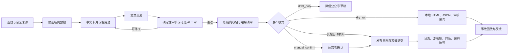

# wechat-official-account-pipeline

[English](README.md)

> 一套面向微信公众号、可审计且保留人工接管能力的自动化流水线，覆盖选题发现、写作、审核、调度、发布和效果反馈。

本项目要解决的不是“如何调用一次群发 API”，而是如何把内容自动化做成可观察、可恢复、可追责的工程系统。每次运行都会生成可检查的文章、审核结果、决策依据和哈希清单；高风险动作必须经过明确授权。

当前状态：**v0.1.0 发布候选版**。默认离线 `dry_run`，外部模型和微信写入全部关闭。

## 与普通自动发文脚本的区别

| 环节 | 普通脚本 | 本项目 |
| --- | --- | --- |
| 新闻输入 | 单一提示词或抓取页面 | 候选排序、备用新闻、来源元数据 |
| 写作 | 一次黑盒模型调用 | 可选的事实提取、批量候选和终稿审核角色 |
| 审核 | 关键词通过/失败 | 确定性规则、可选 AI 二审、风险等级和修复记录 |
| 发布 | 调接口后重试 | 冻结清单、发布意图、运行租约、锁和状态核验 |
| 恢复 | 全流程重跑 | 分阶段检查点和有上限的恢复 |
| 人工接管 | 只能停进程 | dry-run、仅草稿、人工确认、受控自动发布 |
| 日志 | 控制台文本 | JSON 状态、审计日志、运行摘要、SQLite 和事故回放 |

目前的“效果反馈”指运行结果、发布回执与事故分析。公众号读者数据的自动回流仍在路线图中，不属于已完成功能。

代码与配置可以切换回已验证的不可变版本；微信发布属于外部副作用，并不保证可逆，系统会明确记录这一边界，而不会虚构“文章一定能回滚”。

## 完整流程



详细状态边界见 [架构文档](docs/architecture.md)。

## 五分钟快速开始

需要 Python 3.11 或 3.12。以下演示不需要账号、密钥或网络请求。

```powershell
python -m venv .venv
.venv\Scripts\Activate.ps1
python -m pip install -r requirements.lock
python scripts/run_synthetic_demo.py --output-dir demo-output
```

macOS 或 Linux 激活命令为：

```bash
source .venv/bin/activate
```

运行完成后打开 `demo-output/run/article.html`，并检查：

- `content-package.json`：两篇文章与决策元数据。
- `review.json`：确定性审核结果。
- `publish-decision.json`：是否允许发布及原因。
- `content-package.manifest.json`：冻结文件哈希。
- `dry-run-result.json`：本次运行摘要。

`examples/synthetic/` 中的公司、事件、媒体和链接全部为虚构内容。演示不会抓取新闻、调用模型、连接微信或发布文章。


## 接入真实环境

1. 先阅读 [安全模型](docs/security-model.md) 和 [微信权限要求](docs/wechat-permissions.md)。
2. 将 `.env.example` 复制为已被 Git 忽略的 `.env`，只填写实际需要的集成。
3. 基于 `config/news-sources.yaml` 建立私有新闻源配置，并逐一确认抓取条款和内容版权。
4. 保持 `publishing.mode: dry_run`，直到本地产物、审核和通知均正确。
5. 依次经过 `draft_only`、`manual_confirm`，再评估是否启用受控自动发布。
6. `config/schedule.production.example.yaml` 是默认不写入的生产覆盖示例，不会自动打开权限。

任何 AppSecret、模型密钥、Webhook Token、真实文章语料或发布回执都不能进入 Git。

## 微信官方接口权限

真实权限取决于账号类型、认证状态、地区和微信平台当前政策，部署前必须以公众号后台的 **接口权限** 页面为准。

通常需要：

- 可调用服务端 API 的公众号 AppID、AppSecret 和必要的出口 IP 白名单。
- 草稿与素材接口权限，如 `/cgi-bin/draft/add` 和文中图片上传。
- 使用 `freepublish` 时具备 `/cgi-bin/freepublish/submit` 权限。
- 使用 `mass_send_all` 时具备 `/cgi-bin/message/mass/sendall` 高级群发权限。
- 了解账号对应的群发频次、原创校验与 API 群发保护要求。

官方参考：[草稿管理](https://developers.weixin.qq.com/doc/offiaccount/Draft_Box/Add_draft.html)、[发布能力](https://developers.weixin.qq.com/doc/offiaccount/Publish/Publish.html)、[高级群发](https://developers.weixin.qq.com/doc/service/guide/product/message/Batch_Sends.html)、[服务端 API 指南](https://developers.weixin.qq.com/doc/service/guide/dev/api/)。

微信官方发布页注明：自 2025 年 7 月起，个人主体、企业主体未认证及不支持认证的账号会被回收所列发布接口权限。这是必须提前核验的账号条件，软件不能也不会绕过。

## 安全与合规边界

- 默认禁止外部模型和微信写入。
- 非 `dry_run` 模式必须同时通过运行身份授权。
- 高风险内容拒绝发布，中风险内容默认等待人工处理。
- 发布使用运行租约、发布意图、不可变清单和每日发布锁。
- 已有发布意图时只查询和对账，不盲目重复提交。
- 模型调用重试有上限并记录成本相关元数据。
- 新闻文本、图片、RSS 和转载授权由使用者负责。

本项目不会绕过平台审核、原创校验、账号保护或法律义务，也不隶属于腾讯或微信。

## 测试

```powershell
python -m pip install -r requirements.lock -r requirements-dev.lock
python scripts/check_public_tree.py
python -m compileall -q src scripts
python -m ruff check .
python -m unittest discover -s tests
python scripts/run_synthetic_demo.py --output-dir demo-output-ci --date 2026-08-08
```

## 路线图与贡献

- v0.1：脱敏开源基线、离线演示、确定性审核和受控微信流程。
- v0.2：可插拔新闻源、权限探针和配置迁移工具。
- v0.3：可选的读者数据回流与编辑质量评测集。
- 后续：多语言文档、容器示例和社区维护的供应商配置。

贡献前请阅读 [CONTRIBUTING.md](CONTRIBUTING.md)。测试数据必须是合成内容或贡献者有权公开的材料。本项目采用 [Apache-2.0](LICENSE)，版权主体为 `daoqingcheng`。
