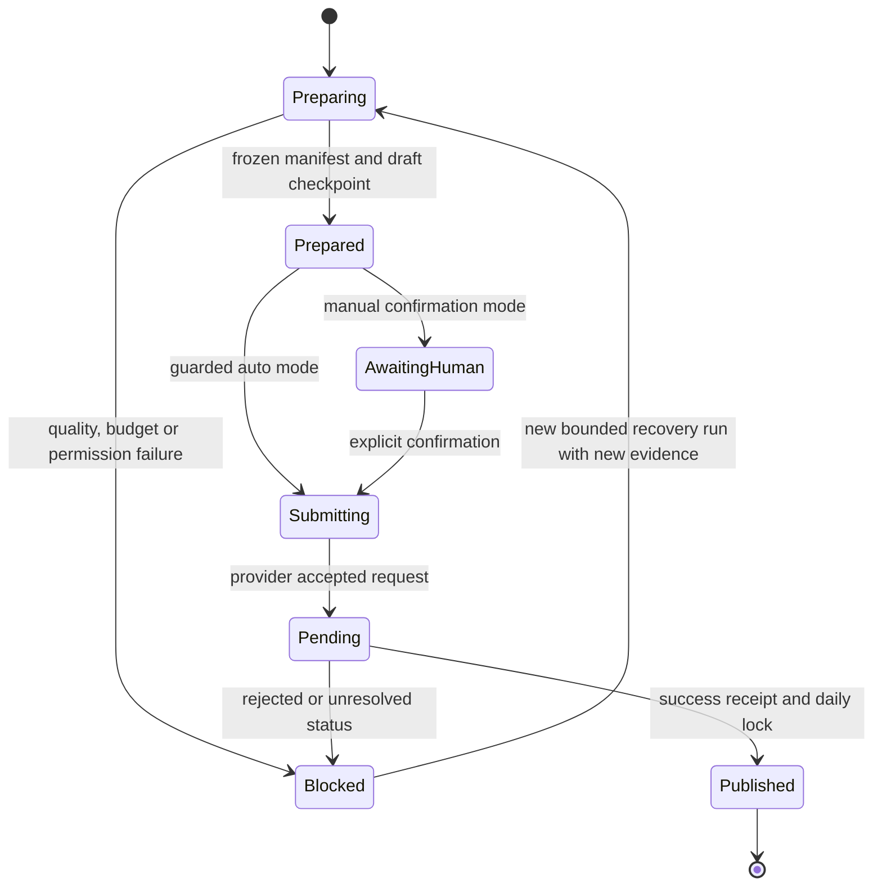

# Architecture

## Design goals

The pipeline prioritises traceability, bounded side effects and operator recovery over maximum autonomy. A successful run should answer five questions without reconstructing console output:

1. Which source records were considered and selected?
2. Which deterministic or model-assisted transformations changed the copy?
3. Which review checks passed, failed or triggered replenishment?
4. Which exact artifact set was approved for publication?
5. Was an external submit attempted, accepted and reconciled?

## Components

| Area | Main modules | Responsibility |
| --- | --- | --- |
| Discovery | `topic_engine.py`, `news_seed.py` | Select topics, fetch permitted feeds, rank and deduplicate candidates |
| Preflight | `candidate_preflight.py`, `fact_cards.py` | Remove promotional residue, identify risky inputs and preserve source facts |
| Drafting | `content_engine.py`, `text_model_enhancer.py` | Build deterministic copy and optionally apply role-specific model output |
| Package | `content_package.py`, `package_manifest.py` | Assemble both articles, replenish missing items and freeze hashes |
| Review | `copy_quality.py`, `review_engine.py`, `publish_policy.py` | Apply quality, provenance, safety and publishing gates |
| WeChat | `create_draft_from_package.py`, `publish_from_draft.py`, `wechat_client.py` | Upload media, create drafts, submit and reconcile status |
| Runtime | `daily_runner.py`, `run_checkpoint.py`, `run_lease.py`, `runtime_guard.py` | Orchestrate stages, identity, budget, checkpoints and mutual exclusion |
| Operations | `publish_watchdog.py`, `run_summary.py`, `incident_replay.py` | Alert, summarise outcomes and replay redacted incidents |

## State and idempotency

The publish intent is written before submission. Once it exists, recovery queries the corresponding status path instead of starting another blind submit. For mass send, a stable `clientmsgid` adds provider-side deduplication. The daily publish lock is written only after a verified success outcome.

## Review and replenishment

The default package requires at least five primary news items and three manufacturing items. Removing a weak or risky item does not silently lower the minimum. The package first draws from same-day reserve candidates; if it remains below the configured minimum, publication stays blocked.

Model output is treated as an untrusted proposal. Deterministic validators can reject a title, lead or summary while retaining source facts. Retry counts, call budgets and recovery cycles are bounded to prevent cost amplification.

## Rollback and recovery

- **Code rollback:** deployment scripts support immutable release directories and a current-release switch. Operators can point the service back to a previously verified release.
- **Configuration rollback:** production configuration lives outside release directories and should be backed up before a controlled change.
- **Content recovery:** frozen manifests and stage checkpoints identify the exact package and completed stage.
- **Published content:** WeChat publication and mass send are external side effects and cannot be promised as reversible. Deletion or recall depends on current platform capabilities and must never be represented as a guaranteed rollback.

## Trust boundaries

Feeds, model endpoints, image endpoints, webhooks and WeChat are external systems. Their responses are parsed, bounded and logged, but not trusted to override local policy. Credentials are read from the environment or an ignored `.env` file and must not enter content artifacts.
